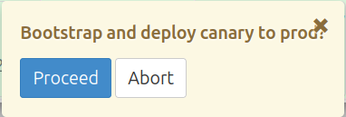
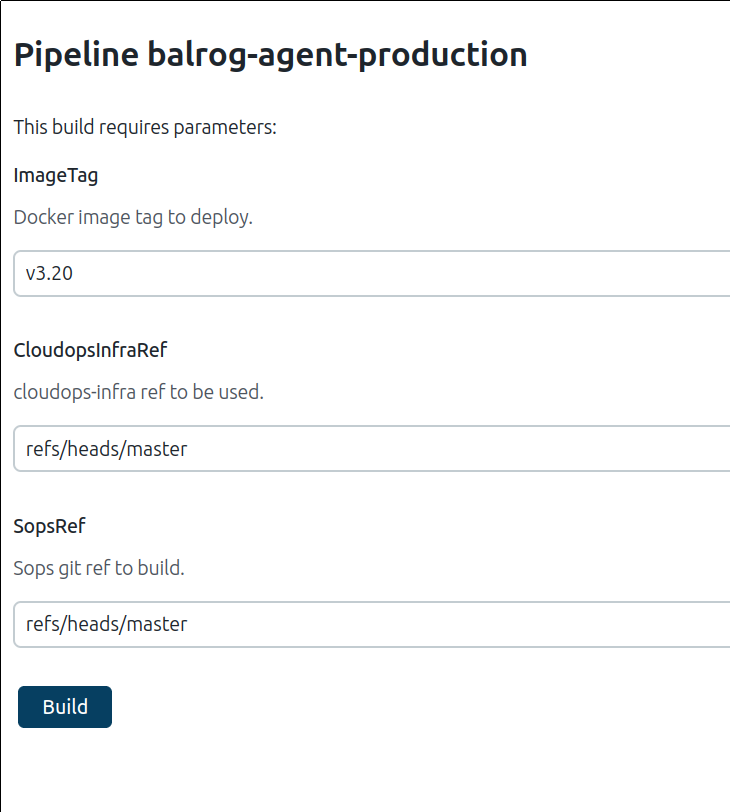

==============
Infrastructure
==============

------------
Environments
------------

We have stage and production deployments of Balrog. Here's a quick summary:

+-------------+-----------+---------------------------------------------------------+-----------------------------------------+-------------------------------------------------------------------------------+
| Environment | App       | URL                                                     | Deploys                                 | Purpose                                                                       |
+=============+===========+=========================================================+=========================================+===============================================================================+
| Production  | Admin API | https://aus4-admin.mozilla.org/                         | Manually, after someone clicks a button | Manage and serve production updates                                           |
+             +-----------+---------------------------------------------------------+ in Jenkins (details below)              +                                                                               +
|             | Admin UI  | https://balrog.services.mozilla.com/                    |                                         |                                                                               |
+             +-----------+---------------------------------------------------------+                                         +                                                                               +
|             | Public    | https://aus5.mozilla.org/                               |                                         |                                                                               |
+-------------+-----------+---------------------------------------------------------+-----------------------------------------+-------------------------------------------------------------------------------+
| Stage       | Admin API | https://admin-stage.balrog.nonprod.cloudops.mozgcp.net/ | When version tags are created in Github | A place to submit staging Releases and verify new Balrog code with automation |
+             +-----------+---------------------------------------------------------+                                         +                                                                               +
|             | Admin UI  | https://balrog-admin-static-stage.stage.mozaws.net/     |                                         |                                                                               |
+             +-----------+---------------------------------------------------------+                                         +                                                                               +
|             | Public    | https://aus5.allizom.org/                               |                                         |                                                                               |
+-------------+-----------+---------------------------------------------------------+-----------------------------------------+-------------------------------------------------------------------------------+

--------------------
Support & Escalation
--------------------

RelEng is the first point of contact for issues. To contact them, follow `the standard RelEng escalation path <https://mozilla-hub.atlassian.net/wiki/spaces/RelEng/overview#%F0%9F%93%B2-Contact-Us>`_.

If RelEng is unable to correct the issue, or unavailable, it can be escalated to the `Services SRE (Purple) team <https://mozilla-hub.atlassian.net/wiki/spaces/SRE/pages/27920178/Services+SRE+-+Purple+Team>`_

--------------------
Monitoring & Metrics
--------------------

Metrics from deployment environments are available in `Grafana/Yardstick <https://yardstick.mozilla.org/d/fRuT9IGZk/balrog?orgId=1&from=now-1h&to=now&timezone=browser&var-env=prod&var-containers=$__all&var-datasource=cdq6ttvymu4g0c&refresh=30s>`_ and `the GCP console <https://console.cloud.google.com/home/dashboard?project=moz-fx-balrog-prod-3fa2&folder=&organizationId=>`_.

We aggregate exceptions from both the Admin & Public apps to `Sentry <https://sentry.io/organizations/mozilla/projects/>`_.

--------
Application & HTTP Logs
--------

Balrog publishes logs to BigQuery which are `available for querying on Google Cloud <https://console.cloud.google.com/bigquery?project=moz-fx-balrog-prod-3fa2>`_. The relevant tables are:

* requests - This table contains HTTP load balancer logs
* stdout - This table contains application logs sent to stdout
* stderr - This table contains application logs sent to stderr

-------
Backups
-------

Balrog uses the built-in GCP backups. The database in snapshotted nightly, and incremental backups are done throughout the day. If necessary, we have the ability to recover to within a 5 minute window. Database restoration is done by the Services SRE (Purple) team, and they should be contacted immediately if needed.

-----------------
Deploying Changes
-----------------
Balrog's `stage and production infrastructure <https://github.com/mozilla-services/cloudops-docs/tree/master/Services/Balrog>`_ are managed by `Services SRE (Purple) team <https://mozilla-hub.atlassian.net/wiki/spaces/SRE/pages/27920178/Services+SRE+-+Purple+Team>`_. Generally, Balrog is deployed on a regular schedule - every 2 weeks, being staged on a Tuesday and deployed to production on a Thursday.

~~~~~~~~~~~~~~~~~~~
Is now a good time?
~~~~~~~~~~~~~~~~~~~

Although we deploy on a regular schedule it is still important to check to make sure no urgent releases are ongoing before deploying. Post a message in `the #releaseduty channel <https://chat.mozilla.org/#/room/#releaseduty:mozilla.org>`_ and wait for confirmation before proceeding with a production deploy.

~~~~~~~~~~~~~~~
Schema Upgrades
~~~~~~~~~~~~~~~
If you need to do a schema change you must ensure that either the current production code can run with your schema change applied, or that your new code can run with the old schema. Code and schema changes cannot be done at the same instant, so you must be able to support one of these scenarios. Generally, additive changes (column or table additions) should do the schema change first, while destructive changes (column or table deletions) should do the schema change second. You can simulate the upgrade with your local Docker containers to verify which is right for you.  In staging and production, the schema upgrade is done automatically as part of the ``balrog-admin-production`` deployment.

A quick way to find out if you have a schema change is to diff the current tip of the main branch against the currently deployed tag, eg:
::

 tag=REPLACEME
 git diff $tag

When deploying a change with schema upgrades it is important to deploy the services in the correct order. Generally, this means that ``balrog-admin-production`` should be finished deploying before ``balrog-production`` for additive changes, and ``balrog-production`` should be finished deploying before ``balrog-admin-production`` for destructive changes.

~~~~~~~~~~~~~~~~~~
Deploying to Stage
~~~~~~~~~~~~~~~~~~
To get the new code in stage you must create a new Release in Github as follows:

1. Tag the repository with a ``vX.Y`` tag. Eg: ``git tag -s vX.Y && git push --tags``
2. Diff against the previous release tag. Eg: ``git diff v2.24 v2.25``, to double whether or not there's schema changes.

  * Look for anything unexpected.

3. `Create a new Release on Github <https://github.com/mozilla-releng/balrog/releases>`_. This create new Docker images tagged with your version, and deploys them to stage. It may take upwards of 30 minutes for the deployment to happen. Deployment notifications will show up in #balrog on Slack.

4. Finally, bump the `in-repo version <https://github.com/mozilla-releng/balrog/blob/main/pyproject.toml>`_ to the next available one to ensure the next push gets a new version.

Once the changes are deployed to stage, you should do some testing to make sure that the new features, fixes, etc. are working properly there. It's a good idea to `watch Sentry for new exceptions <https://sentry.io/organizations/mozilla/projects/>`_ that may show up, and Grafana for any notable changes in the shape of the traffic.

**Important Note!** Only two-part version numbers (like shown above) are supported by our deployment pipeline.

~~~~~~~~~~~~~~~~~~~~~
Pushing to Production
~~~~~~~~~~~~~~~~~~~~~

Pushing the backends live requires some button clicking in Jenkins. For each of
`balrog-admin-production <https://ops-master.jenkinsv2.prod.mozaws.net/job/gcp-pipelines/job/balrog/job/balrog-admin-production/>`_,
`balrog-production <https://ops-master.jenkinsv2.prod.mozaws.net/job/gcp-pipelines/job/balrog/job/balrog-production/>`_,
and `balrog-agent-production <https://ops-master.jenkinsv2.prod.mozaws.net/job/gcp-pipelines/job/balrog/job/balrog-agent-production/>` in Jenkins do the following. (If there are no schema changes, these may be done in parallel. If there are schema changes, see ``Schema Upgrades``):

  * Find the ``PROD: DEPLOY`` or ``PROD: PROCEED`` step
  * Click the cell for this step in the topmost row. This should bring up a confirmation dialog as shown below.
  * Click ``Proceed``

After this, there is nothing else to do for ``balrog-admin-production`` nor ``balrog-agent-production``. However, the public app (``balrog-production``) will first deploy a canary (meaning the new code will only be used for a small fraction of requests).

Before proceeding, you should monitor for changes in load or exceptions for at least a few minutes. Specifically:
- Watch Sentry to see if any new exceptions show up for any of the backend services
- Watch the Grafana graphs for spikes or dips in any of the charts

If anything notable comes up you should seek an explanation for it before proceeding. If you are unable to explain the issue, consult with someone else and consider rolling back in the meantime.

When you are ready, find the ``PROD: PROMOTE`` cell in Jenkins and click ``Proceed`` to finish with this deployment.

To push new UI to production you must delete and recreate the "production-ui" tag & release on Github to push the new UI to production:

  * On https://github.com/mozilla-releng/balrog/releases/tag/production-ui, click "Delete" (this deletes the Github Release).
  * On https://github.com/mozilla-releng/balrog/releases/tag/production-ui, click "Delete" (this deletes the Git tag, even though it's the same URL).
  * On https://github.com/mozilla-releng/balrog/releases/new, create a new `production-ui` Release. This will trigger automation to deploy the new UI.

~~~~~~~~~
Rollbacks
~~~~~~~~~

To rollback the admin, public, and agent backends, do the following for each of ``balrog-admin-production``, ``balrog-production``, and ``balrog-agent-production`` in Jenkins:

  * Click "Build with Parameters" in the menu on the left.
  * Put the version you want to redeploy in the ``ImageTag`` field. This should be in the form of ``vX.Y``, eg: ``v3.20``.
  * Click ``Build``

As in this screenshot:

This will begin a deployment as described above. See the ``Pushing to Production`` section above for how to proceed with the production deployment from here.

If the UI needs a rollback, after deleting the previous production-ui release and tag as above, update the "production-ui" tag to point to the earlier version. Something like (to point to v3.08):
::

 git tag -d production-ui
 git tag -s production-ui v3.08^{}
 git push origin production-ui
