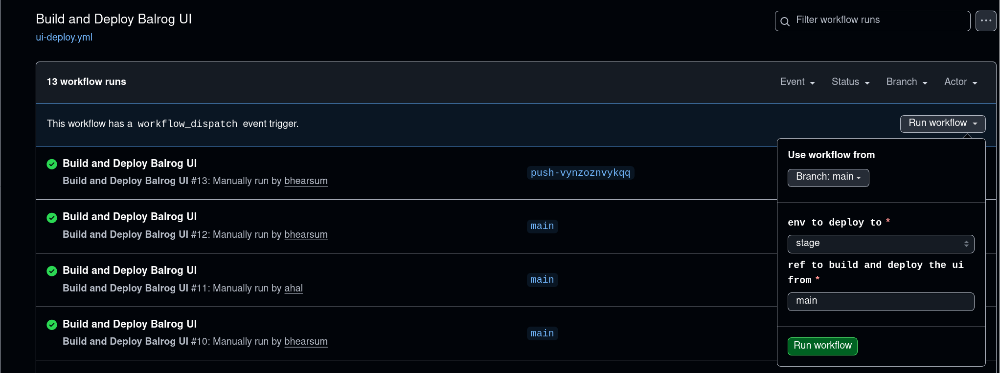
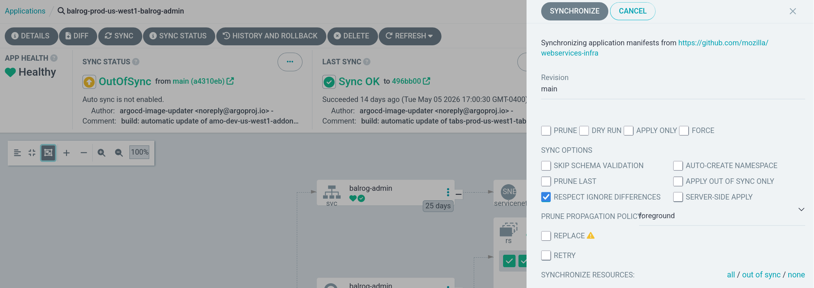
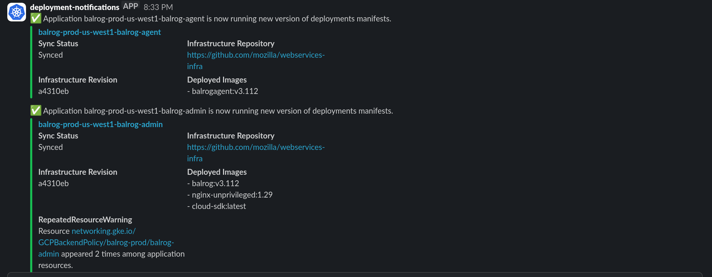
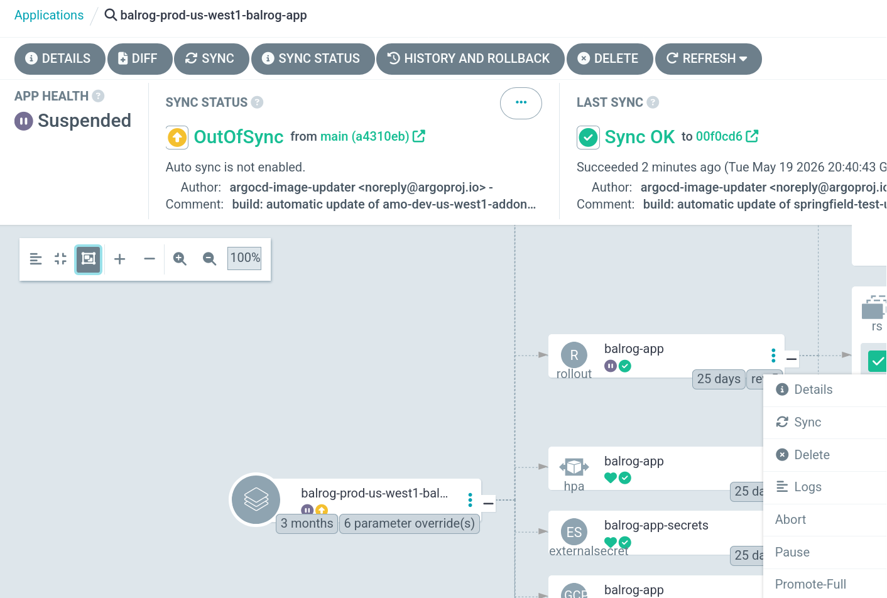
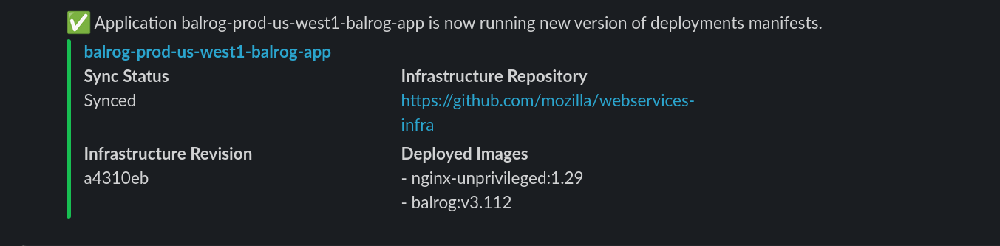
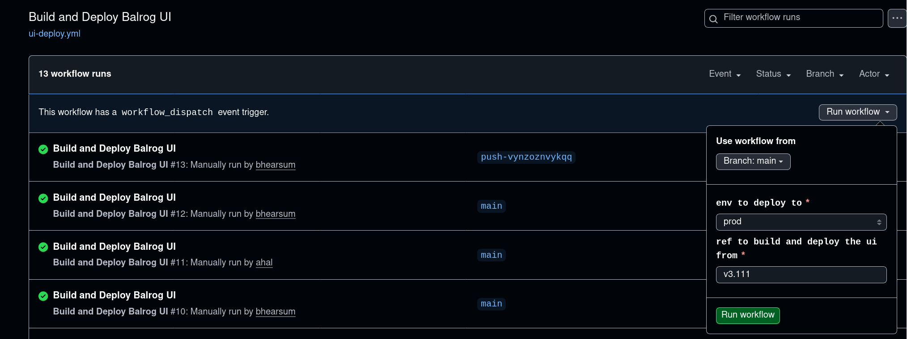

==============
Infrastructure
==============

------------
Environments
------------

We have stage and production deployments of Balrog. Here's a quick summary:

+-------------+-----------+---------------------------------------------------------------+-----------------------------------------+-------------------------------------------------------------------------------+
| Environment | App       | URL                                                           | Deploys                                 | Purpose                                                                       |
+=============+===========+===============================================================+=========================================+===============================================================================+
| Production  | Admin API | https://aus4-admin.mozilla.org/                               | When a sync is performed in ArgoCD      | Manage and serve production updates                                           |
+             +-----------+---------------------------------------------------------------+ after a staging deployment.             +                                                                               +
|             | Admin UI  | https://balrog.mozilla.org/                                   |                                         |                                                                               |
+             +-----------+---------------------------------------------------------------+                                         +                                                                               +
|             | Public    | https://aus5.mozilla.org/, https://aus-api.mozilla.org        |                                         |                                                                               |
+-------------+-----------+---------------------------------------------------------------+-----------------------------------------+-------------------------------------------------------------------------------+
| Stage       | Admin API | https://admin.stage.balrog.nonprod.webservices.mozgcp.net     | When the "Pull and Push Docker Image"   | A place to submit staging Releases and verify new Balrog code with automation |
+             +-----------+---------------------------------------------------------------+ Github Action is run, and a sync is     +                                                                               +
|             | Admin UI  | https://balrog.allizom.org                                    | performed in ArgoCD                     |                                                                               |
+             +-----------+---------------------------------------------------------------+                                         +                                                                               +
|             | Public    | https://aus5.allizom.org (CDN)                                |                                         |                                                                               |
|             |           | https://stage.balrog.nonprod.webservices.mozgcp.net (backend) |                                         |                                                                               |
+-------------+-----------+---------------------------------------------------------------+-----------------------------------------+-------------------------------------------------------------------------------+

--------------------
Support & Escalation
--------------------

RelEng is the first point of contact for issues. To contact them, follow `the standard RelEng escalation path <https://mozilla-hub.atlassian.net/wiki/spaces/RelEng/overview#%F0%9F%93%B2-Contact-Us>`_.

If RelEng is unable to correct the issue, or unavailable, it can be escalated to the `Services SRE (Purple) team <https://mozilla-hub.atlassian.net/wiki/spaces/SRE/pages/27920178/Services+SRE+-+Purple+Team>`_

--------------------
Monitoring & Metrics
--------------------

Metrics from deployment environments are available in `Grafana/Yardstick <https://yardstick.mozilla.org/d/fRuT9IGZk/balrog?orgId=1&from=now-1h&to=now&timezone=browser&var-env=prod&var-containers=$__all&var-datasource=cdq6ttvymu4g0c&refresh=30s>`_ and `the GCP console <https://console.cloud.google.com/home/dashboard?project=moz-fx-balrog-prod-3fa2&folder=&organizationId=>`_.

We aggregate exceptions from both the Admin & Public apps to `Sentry <https://sentry.io/organizations/mozilla/projects/>`_.

-----------------------
Application & HTTP Logs
-----------------------

Balrog publishes logs to BigQuery which are `available for querying on Google Cloud <https://console.cloud.google.com/bigquery?project=moz-fx-balrog-prod-3fa2>`_. The relevant tables are:

* requests - This table contains HTTP load balancer logs
* stdout - This table contains application logs sent to stdout
* stderr - This table contains application logs sent to stderr

-------
Backups
-------

Balrog uses the built-in GCP backups. The database in snapshotted nightly, and incremental backups are done throughout the day. If necessary, we have the ability to recover to within a window of a few seconds. If a database restoration is needed, contact the MozCloud engineering team.

-----------------
Deploying Changes
-----------------

Balrog's infrastructure is managed by the terraform and kubernetes IaC that `lives in the webservices-infra repository <https://github.com/mozilla/webservices-infra/tree/main/balrog>`_ and is owned by the CloudEng team.

~~~~~~~~~~~~~~~
Schema Upgrades
~~~~~~~~~~~~~~~
If you need to do a schema change you must ensure that either the current production code can run with your schema change applied, or that your new code can run with the old schema. Code and schema changes cannot be done at the same instant, so you must be able to support one of these scenarios. Generally, additive changes (column or table additions) should do the schema change first, while destructive changes (column or table deletions) should do the schema change second. You can simulate the upgrade with your local Docker containers to verify which is right for you.  In staging and production, the schema upgrade is done automatically as part of the ``admin`` deployment.

A quick way to find out if you have a schema change is to diff the current tip of the main branch against the currently deployed tag, eg:
::

 git diff v3.110

When deploying a change with schema upgrades it is important to deploy the services in the correct order. Generally, this means that ``admin`` should be finished deploying before ``app`` for additive changes, and ``app`` should be finished deploying before ``admin`` for destructive changes.

~~~~~~~~~~~~~~~~~~
Deploying to Stage
~~~~~~~~~~~~~~~~~~

1. Create a release on Github. There is no need to tag by before this; the tag can be created as part of the release. For example:

.. image:: create-release.png

Creating the release will fire some Taskcluster tasks that create and push docker images to Dockerhub. Wait for these to complete before proceeding to step 2.

2. Kick-off the deployment pipeline in ArgoCD. This can be done by running the "Pull and Push Docker Image" `Github Action <https://github.com/mozilla-releng/balrog/actions/workflows/docker-push.yml>`_ like so:

.. image:: run-action.png

Once that completes, `ArgoCD <https://webservices.argocd.global.mozgcp.net/applications?proj=balrog-nonprod>`_ will begin updating ``stage`` deployments automatically `(it usually takes about 5 mins to start after the docker image is pushed)`. This will immediately roll out the new version of ``admin`` and ``agent``, and start the canary rollout process for ``app``. You must also continue the rollout for ``app`` `in ArgoCD <https://webservices.argocd.global.mozgcp.net/applications/argocd-webservices/balrog-stage-us-west1-balrog-app?view=tree&resource=>`_ to ensure all pods are running the new version. To do this, find the ``balrog-app`` rollout, click the 3 dots menu, and then click ``Promote-Full``:

.. image:: balrog-app-3-dots.png

Once Argo has finished updating everything, you should see notifications for ``agent``, ``admin`` and ``app`` in Slack:

.. image:: deployment-notifications.png

3. Deploy the UI by running the `"Build and Deploy Balrog UI" GitHub action <https://github.com/mozilla-releng/balrog/actions/workflows/ui-deploy.yml>`_. Be sure to choose "stage" from the dropdown:

4. Bump the `in-repo version <https://github.com/mozilla-releng/balrog/commit/6067671d6a055de1b399ad32b342f0789fea03fc>`_ to the next available one to ensure the next push gets a new version.

Once the changes are deployed to stage, you should do some testing to make sure that the new features, fixes, etc. are working properly there. It's a good idea to `watch Sentry for new exceptions <https://mozilla.sentry.io/issues/?project=6262499&project=6262501&project=6262502>`_ that may show up, and Grafana for any notable changes in the shape of the traffic.

**Important Note!** Only two-part version numbers (like shown above) are supported by our deployment pipeline.

~~~~~~~~~~~~~~~~~~~~~
Pushing to Production
~~~~~~~~~~~~~~~~~~~~~

Note: Pushing to production requires that the "Pull and Push Docker Image" for the desired version has already been run (usually as part of the Stage deployment described above). This is required to get ArgoCD into the necessary state for the following instructions to work.

To begin the production deployment process you must "Sync" ``admin``, ``agent``, and ``app`` `in ArgoCD <https://webservices.argocd.global.mozgcp.net/applications?proj=balrog-prod>`_. For the former two, the deployment process is complete once this finishes successfully. For the latter, this will only deploy a canary pod, allowing a fraction of requests to be handled by the new release.

Once Argo has finished updating everything, you should see notifications for ``agent`` and ``admin`` in Slack (no notification will be sent for ``app`` until the rollout is promoted later):

To deploy the new UI to production, run the "Build and Deploy Balrog UI" Github action. Be sure to choose "prod" from the dropdown:

Before proceeding, you should monitor for changes in load or exceptions for at least a few minutes. Specifically:

- Watch `Sentry <https://mozilla.sentry.io/issues/?project=6262508&project=6262505&project=6262506>`_ to see if any new exceptions show up for any of the backend services
- Watch `the Grafana graphs <https://yardstick.mozilla.org/d/fRuT9IGZfsdfweAA/balrog3a-mozcloud-v2?orgId=1&from=now-1h&to=now&timezone=browser&var-env=prod&var-containers=$__all&var-datasource=adpvtjmrxoc1sb&refresh=30s&editIndex=0>`_ for spikes or dips in any of the charts

If anything notable comes up you should seek an explanation for it before proceeding. If you are unable to explain the issue, consult with someone else and consider rolling back in the meantime.

When you are satisfied that the ``app`` canary is functioning correctly, and no issues have been found, proceed to promote the canary to full rollout with the "Promote-Full" option:

Once Argo has finished promoting the rollout, you should see a notification for ``app`` in Slack:

You have now fully deployed the new version of Balrog to production!

~~~~~~~~~
Rollbacks
~~~~~~~~~

See https://mozilla-hub.atlassian.net/wiki/spaces/SRE/pages/1703772181/How+to+Rolling+back+to+a+previous+application+deployment.

^^
UI
^^

To revert UI changes, re-run the "Build and Deploy Balrog UI" action, specifying a different ref (preferably the previous release tag):

